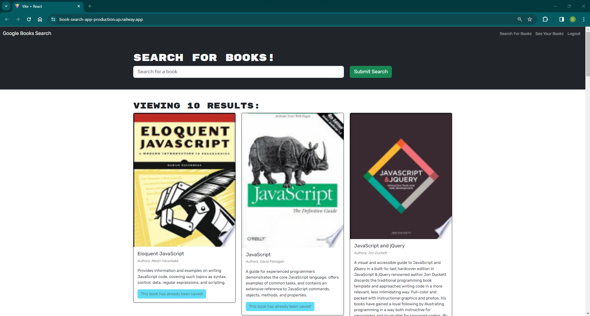
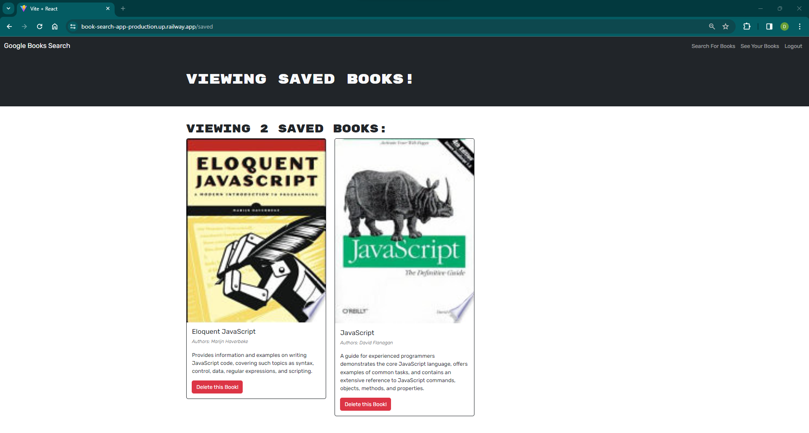
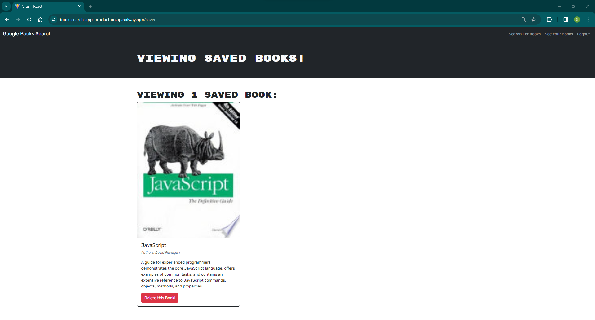

# Title 
Book-Search-App

## Description who/what/why/when/how
This book app is a refactored Google book api using MERN. 

Going into this project felt like it'd be an easy project, but getting into the in's and out's of Apollo and GQL. After getting most of the back-end setup

it seemed like it would have ran smoothly, but I soon found out a lot of the knowledge I had for implementing my resolvers and typedefs based on the models was fairly limited in terms of my knowledge of MySQL, it took quite a bit of debugging on the front and back end as well as some help, and a lot of reading from the Apollo docs. Looking at it now as a working app, I can still see multiple areas where my code could use improvement.  I feel like this is one of the projects that taught me the most, and has made diving into other Apollo applications a lot smoother! 

To see the base code for this project please see [code base](https://github.com/coding-boot-camp/solid-broccoli)
To see the requirements for this project please see the references folder and the file titled reference.md

## Table of Contents (Optional)

- [Installation](#installation)
- [Usage](#usage)
- [Credits](#credits)
- [License](#license)

## Installation 
NPM install to run locally, then NPM run develop from base. Please see live site link below: 
[Book search app](book-search-app-production.up.railway.app)

## Usage 

    

## Credits 
Andrew Hardemon (tutor) CJ (always helping), Jacek Hacking (helping with deploy)! You guys rock!

## License 

## License Link 
[license: MIT](https://opensource.org/licenses/MIT)

---
# License section 

  Copyright 2023 saevans86
  
  Permission is hereby granted, free of charge, to any person obtaining a 
  copy of this software and associated documentation files (the “Software”),
  to deal in the Software without restriction, including without limitation the rights
  to use, copy, modify, merge, publish, distribute, sublicense, and/or sell copies 
  of the Software, and to permit persons to whom the Software is furnished to do so, 
  subject to the following conditions:
  The above copyright notice and this permission notice shall be included in all copies 
  or substantial portions of the Software.
      
  THE SOFTWARE IS PROVIDED “AS IS”, WITHOUT WARRANTY OF ANY KIND, EXPRESS OR IMPLIED, 
  INCLUDING BUT NOT LIMITED TO THE WARRANTIES OF MERCHANTABILITY, FITNESS FOR A PARTICULAR PURPOSE AND NONINFRINGEMENT. 
  IN NO EVENT SHALL THE AUTHORS OR COPYRIGHT HOLDERS BE LIABLE FOR ANY CLAIM, DAMAGES OR OTHER LIABILITY, WHETHER IN AN ACTION OF CONTRACT, 
  TORT OR OTHERWISE, ARISING FROM, OUT OF OR IN CONNECTION WITH THE SOFTWARE OR THE USE OR OTHER DEALINGS IN THE SOFTWARE.
      

## Features 
Ability to login, signup, search, save, delete books.

## Tests 
No tests have been ran

## Questions 
# Please contact me at:
 github username: saevans86 e-mail: sam_evans1986@hotmail.com

